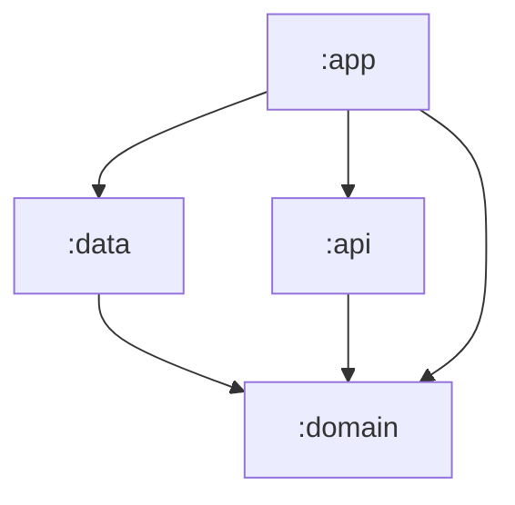

# sasd-detection-tool-api


## :clipboard: Overview

`sasd-detection-tool-api` is the RESTful backend API for the SASD Detection Tool.

The API fetches artefacts from version control system repositories &mdash; currently GitHub &mdash; including commit messages, issues, and source code.
These artefacts are passed to a configurable LLM provider (currently Google Gemini and Anthropic Claude) for natural language processing,
where each artefact is analysed for instances of _Self-Admitted Security Debt_ (SASD).
Any detected debt instances are mapped to a relevant entry in the [Common Weakness Enumerations](https://cwe.mitre.org/) (CWE).

Built with Kotlin and Spring Boot, the API follows [Clean Architecture](https://blog.cleancoder.com/uncle-bob/2012/08/13/the-clean-architecture.html) principles across a multi-module Gradle project,
ensuring a clear separation of concerns and framework-agnostic domain logic.

## :classical_building: Architecture

`sasd-detection-tool-api` follows [Clean Architecture](https://blog.cleancoder.com/uncle-bob/2012/08/13/the-clean-architecture.html) principles across a multi-module Gradle project.
Each module has a single, well-defined responsibility, and dependencies are strictly enforced at compile time by Gradle
&mdash; preventing architectural violations from ever reaching runtime.

### Module Dependency Graph



### Module Breakdown

| Module    | Responsibility                                                                                                                                  |
|-----------|-------------------------------------------------------------------------------------------------------------------------------------------------|
| `:domain` | Highest-level policies. Contains business entities, gateway contracts, and interactor interfaces and implementations. No external dependencies. |
| `:data`   | Implements domain gateway contracts. Handles all external communication &mdash; GitHub and LLM APIs via Ktor Client.                            |
| `:api`    | Spring Boot web layer. Contains controllers, request/response models, and exception handling.                                                   |
| `:app`    | Application entry point. Bootstraps the Spring context and wires together all dependencies.                                                     |

### Key Architectural Decisions

- **`:domain` has no external dependencies** &mdash; business logic is framework-agnostic and fully portable
- **Ktor Client in `:data`** &mdash; coroutine-native HTTP client, consistent with idiomatic Kotlin and avoids leaking Spring's `RestTemplate` outside `:api`
- **Pluggable LLM provider** &mdash;  the `NlpGateway` contract in `:domain` decouples the app from any specific LLM

### Dependency Rules

| Module    | Can depend on | Cannot depend on        |
|-----------|---------------|-------------------------|
| `:domain` | Nothing       | `:data`, `:api`, `:app` |
| `:data`   | `:domain`     | `:api`, `:app`          |
| `:api`    | `:domain`     | `:data`, `:app`         |
| `:app`    | All modules   | &mdash;                 |

## :gear: Prerequisites

_To be completed once Dockerised_

## :rocket: Getting Started

_To be completed once Dockerised_

## :satellite: API Reference

### Health

| Method | Endpoint  | Description  |
|--------|-----------|--------------|
| `GET`  | `/health` | Health check |

### VCS

| Method | Endpoint              | Query Parameters      | Description                |
|--------|-----------------------|-----------------------|----------------------------|
| `GET`  | `/vcs/repo-structure` | `repoUrl`             | Fetch repository structure |
| `GET`  | `/vcs/file-content`   | `repoUrl`, `filePath` | Fetch file content         |

### Analysis

| Method | Endpoint                  | Description                                     |
|--------|---------------------------|-------------------------------------------------|
| `POST` | `/analysis/commits`       | Analyse all commits in a repository             |
| `POST` | `/analysis/issuess`       | Analyse all issues in a repository              |
| `POST` | `/analysis/code-comments` | Analyse all comments in a provided code snippet |
| `POST` | `/analysis/file-comments` | Analyse all comments in a source code file      |
| `POST` | `/analysis/repository`    | Analyse all artefacts in a repository           |

## :key: Environment Variables

Configuration is managed via a `.env` file at the repo root. To get started:

```bash
cp .env.example .env
```

Then populate `.env` with your values:

| Variable          | Description                                                                 | Required           |
|-------------------|-----------------------------------------------------------------------------|--------------------|
| `GITHUB_TOKEN`    | GitHub personal access token for VCS API authentication                     | :white_check_mark: |
| `GITHUB_BASE_URL` | GitHub API base URL                                                         | :white_check_mark: |
| `LLM_PROVIDER`    | LLM provider to use (`anthropic`, `google`, etc)                            | :white_check_mark: |
| `LLM_API_KEY`     | API key for configured LLM provider                                         | :white_check_mark: |
| `LLM_BASE_URL`    | Base URL for configured LLM provider &mdash; not required for all providers | :warning:          |
| `LLM_MODEL`       | Model identifier for configured LLM provider                                | :white_check_mark: |

> In production, environment variables should be injected directly by your hosting platform.

## :test_tube: Running Tests

To run the full test suite:

```bash
./gradlew test
```

To run tests for a specific module:

```bash
./gradlew :domain:test
./gradlew :data:test
./gradlew :api:test
./gradlew :app:test
```
