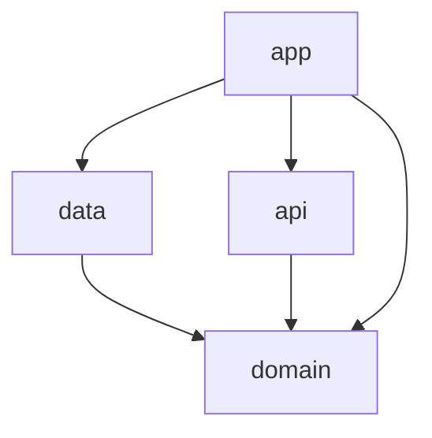

# sasd-detection-tool-api
Kotlin Spring Boot backend for the SASD Detection Tool.

## Overview

## Architecture

## Module Breakdown

## Dependency Graph

```mermaid
graph TD
    domain
    data --> domain
    api --> domain
    app --> domain
    app --> api
    app --> data
```

## Getting Started

## Tech Stack
