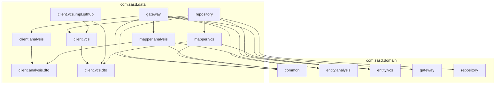

# `:data:`

## Purpose
The `:data:` module provides concrete implementations of the repository and gateway interfaces defined in `:domain:`.
It handles all external communication — fetching VCS data from the GitHub API via Ktor and performing NLP analysis via an LLM provider API.
DTOs are deserialized using kotlinx.serialization and mapped to domain entities through dedicated mapper functions.

## Dependency Rules

This module depends only on `:data`. No other modules are accessible.

## Dependency Graph

