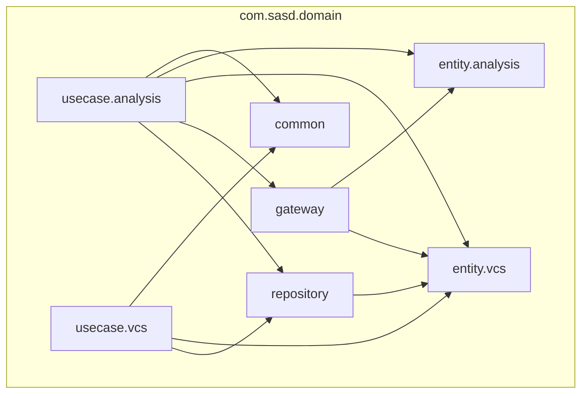

# `:domain:`

## Purpose
The `:domain:` module contains the core business logic for the SASD detection tool. 
It defines entities, use cases, and gateway/repository interfaces that are independent of any framework or external dependency. 
Implementations are provided by the `:data:` layer.

## Dependency Rules

This module has zero external dependencies &mdash; it depends only on the Kotlin standard library.
No frameworks, no third-party libraries.
This is enforced at compile time by Gradle.

## Dependency Graph

